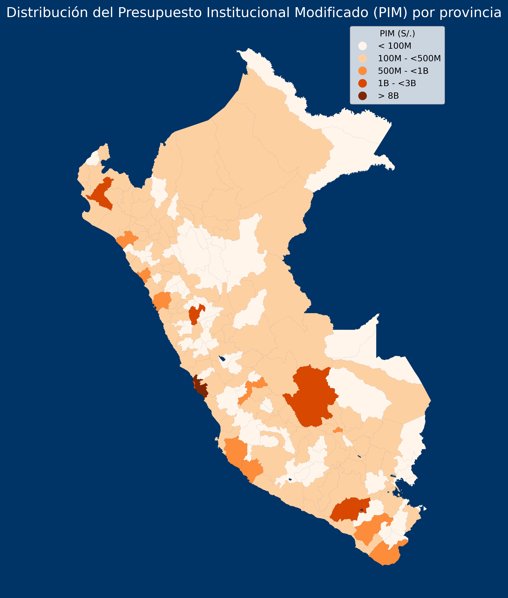
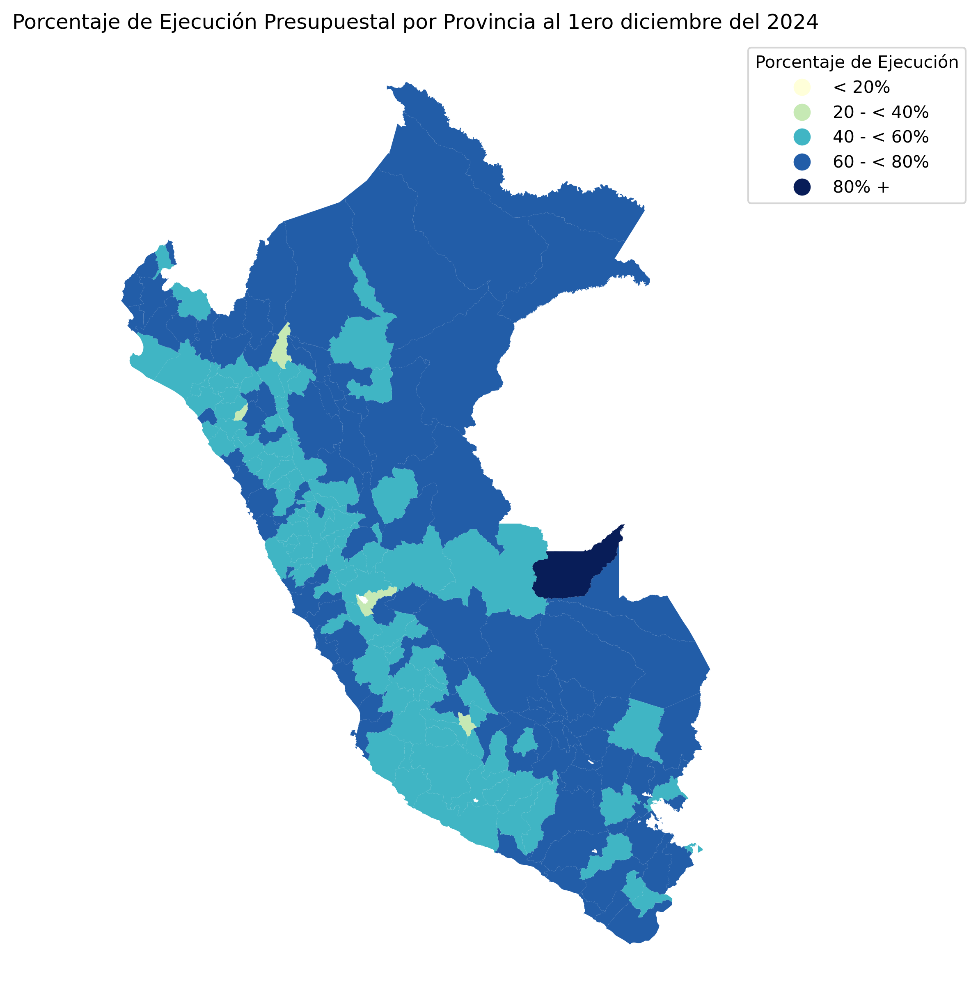
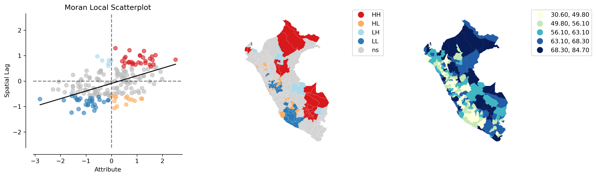
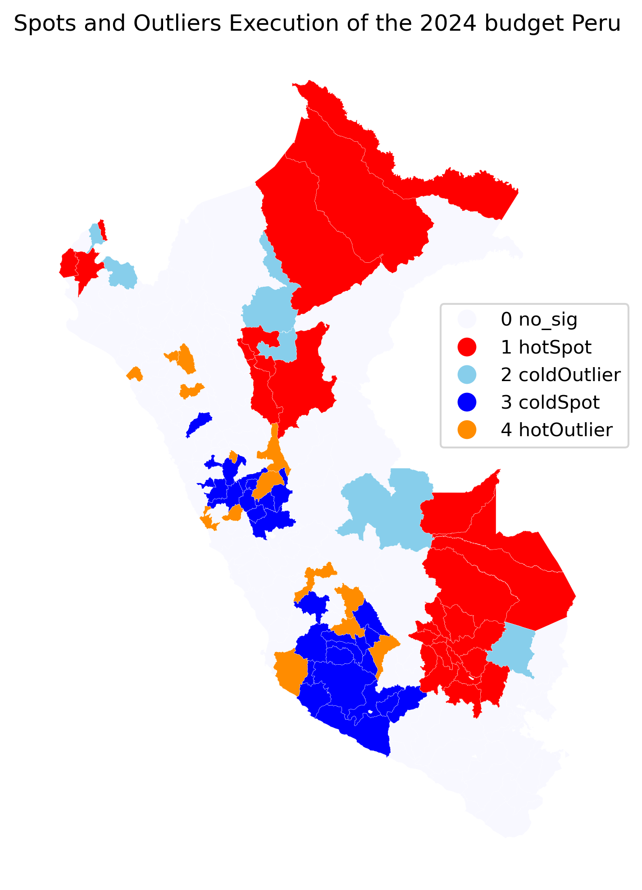

```{r setup, include=FALSE}
library(flexdashboard) # always
```

## Sidebar {.sidebar}


Preparing the dashboard based on the instructions given at @magallanes_reyes_data_2022, and @aden-buie_flexdashboard_2023.

This dashboard provides a georeferenced analysis of the 2024 Modified Institutional Budget (MIB) allocated at the provincial level in Peru. It also displays the budget execution percentage at the provincial level as of December 1, 2024, along with an analysis using the Local Indicator of Budget Execution (LISA).

## Column {.tabset .tabset-fade}


### PIM 2024 (Province)



### Execution Budget Dicember 1st 2024




### Analysis




### Spots and outliers Budget execution December 1st 2024




### References 
