```{r setup, include=FALSE}
library(flexdashboard) # always
```

Sidebar {.sidebar}
=====================================


Preparing the dashboard based on the instructions given at @magallanes_reyes_data_2022, and @aden-buie_flexdashboard_2023.

This are the results of Covid analysis in Peru through the years based on open data 

LISA and Bivariate LISA analysis were conducted to explore the spatial clustering and local spatial relationships within the dataset.

Chapter 1
===================================== 


### Covid 2021: analysis

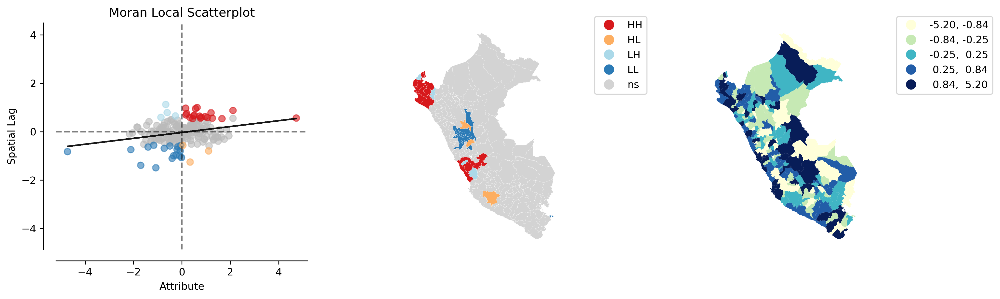

### Covid outliers (Pronvince)
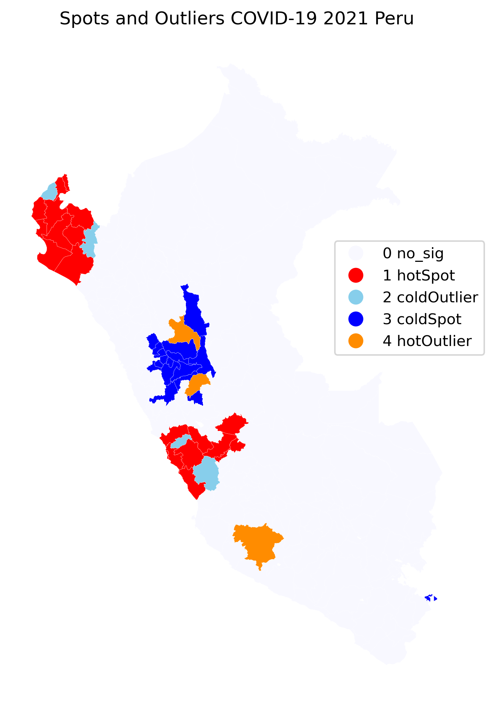


Chapter 2
===================================== 


### Covid 2022: analysis

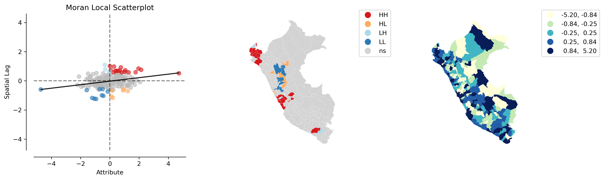

### Covid outliers (Pronvince)

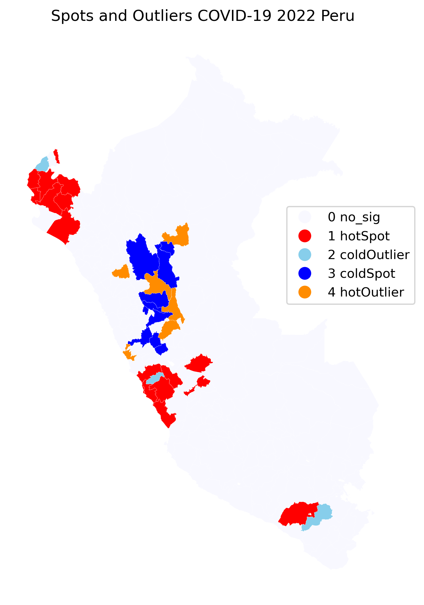


Chapter 3
===================================== 


### Covid 2023: analysis

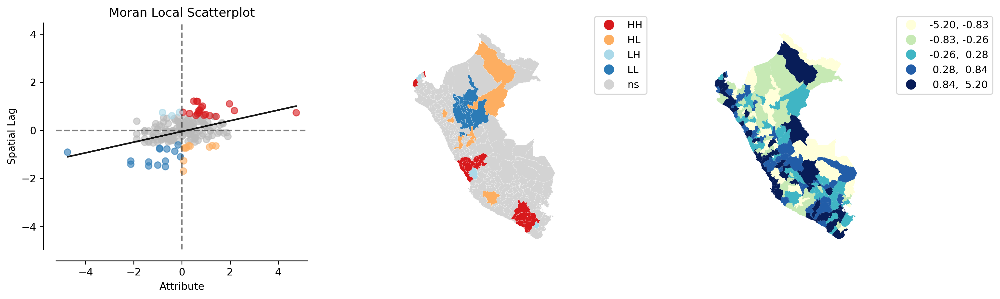


### Covid outliers (Pronvince)

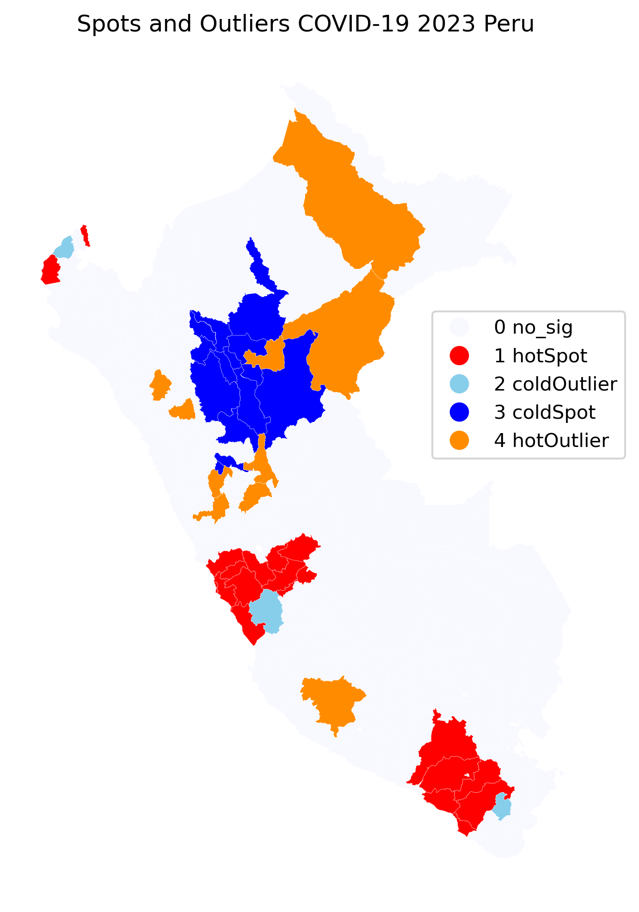


Chapter 4
===================================== 


### Covid 2024: analysis

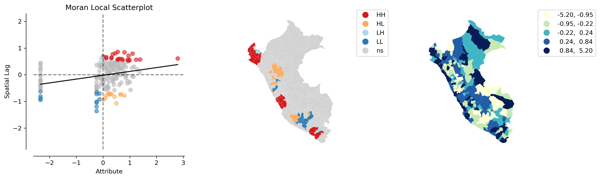

### Covid outliers (Pronvince)

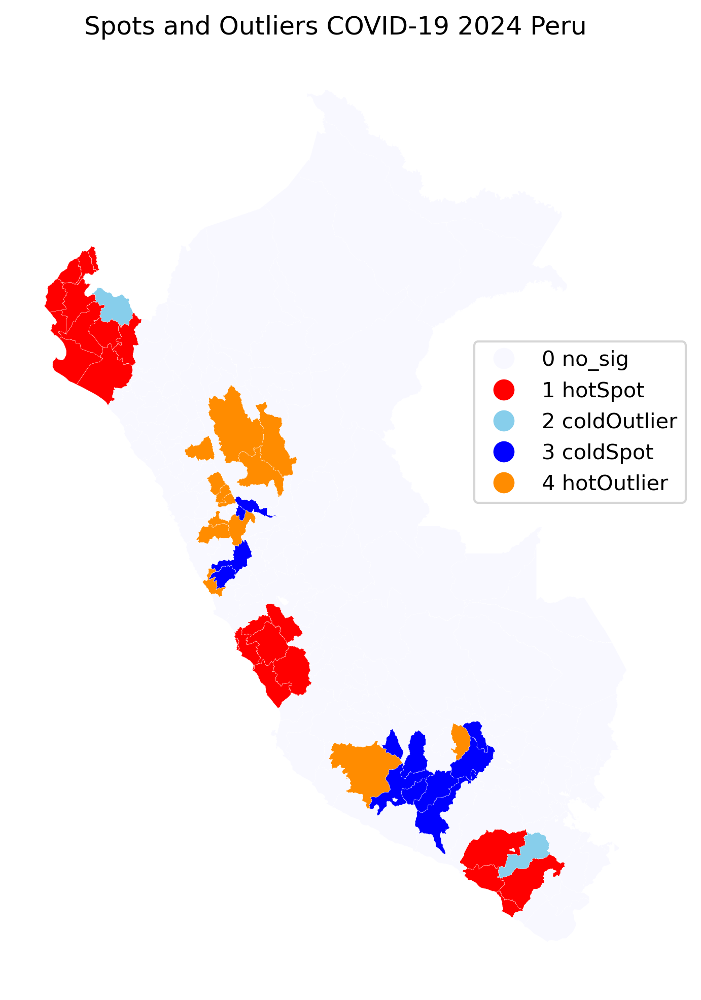


Chapter 5
===================================== 


Column 1
------------------------------------

{width=80%}


Column 2
------------------------------------

{width=80%}


Column 3
------------------------------------

{width=80%}


Column 4
------------------------------------

{width=80%}


Chapter 6
===================================== 


Row 1
------------------------------------

### COVID 2020-2021

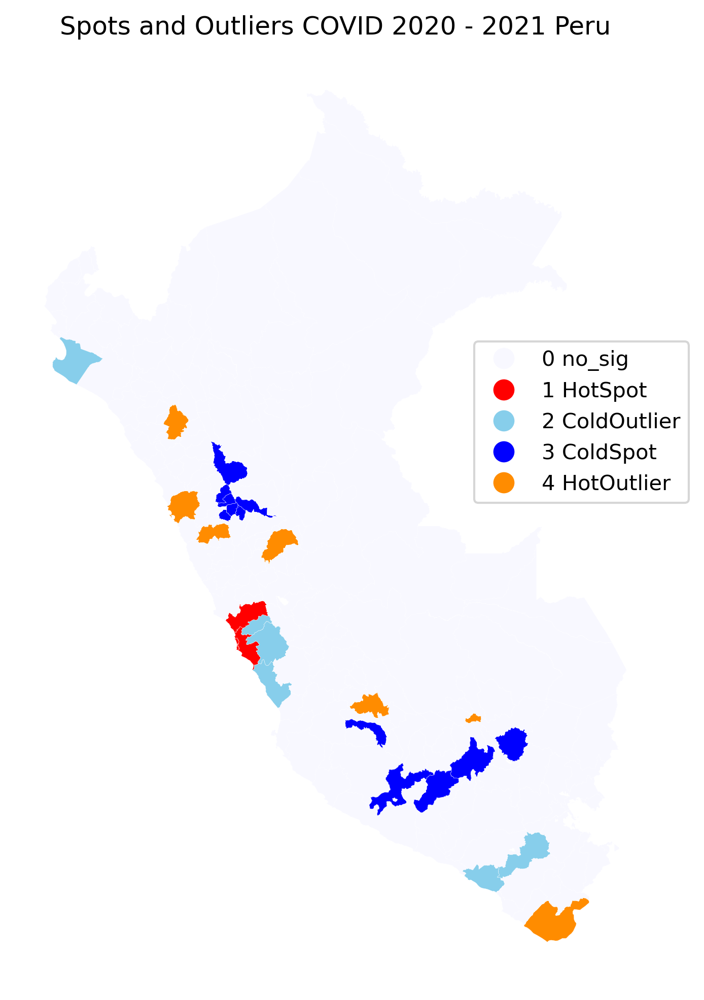{width=80%}

### COVID 2021-2022

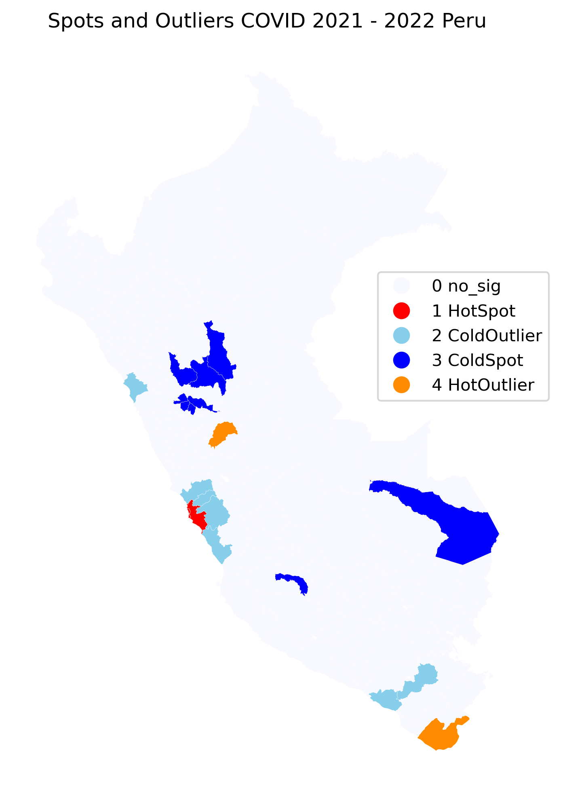{width=80%}

Row 2
------------------------------------

### COVID 2022 - 2023

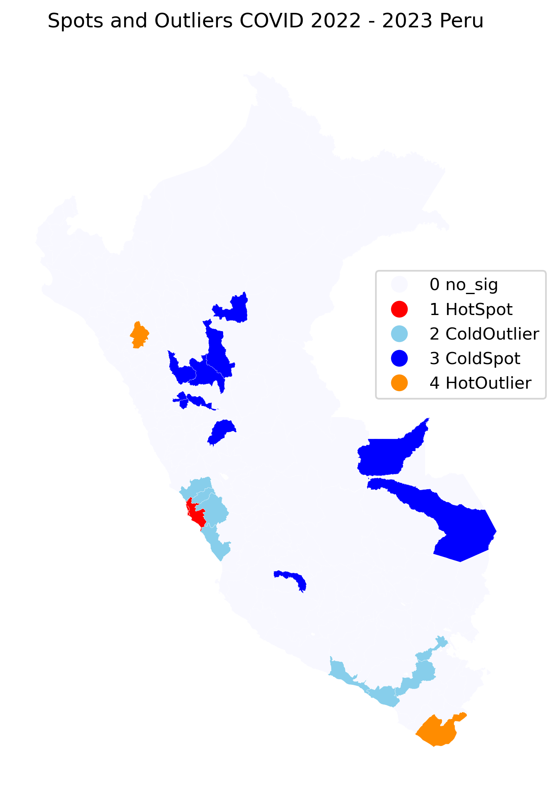{width=80%}

### COVID 2023 - 2024

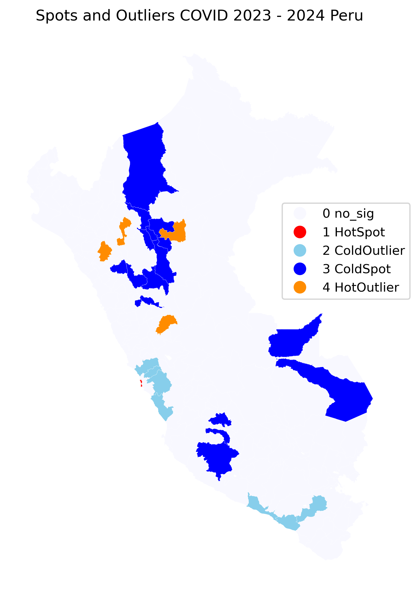{width=80%}


References
===================================== 

### 
