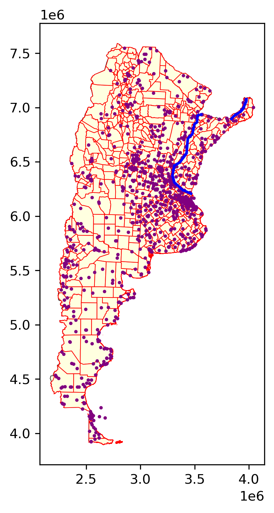
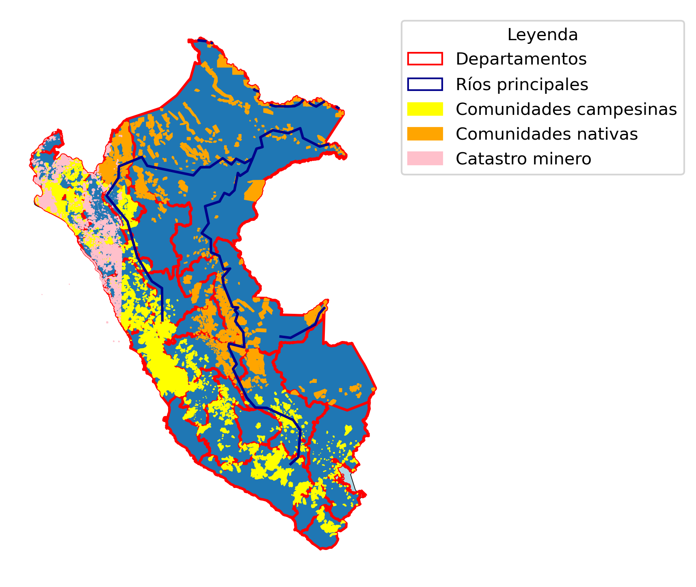
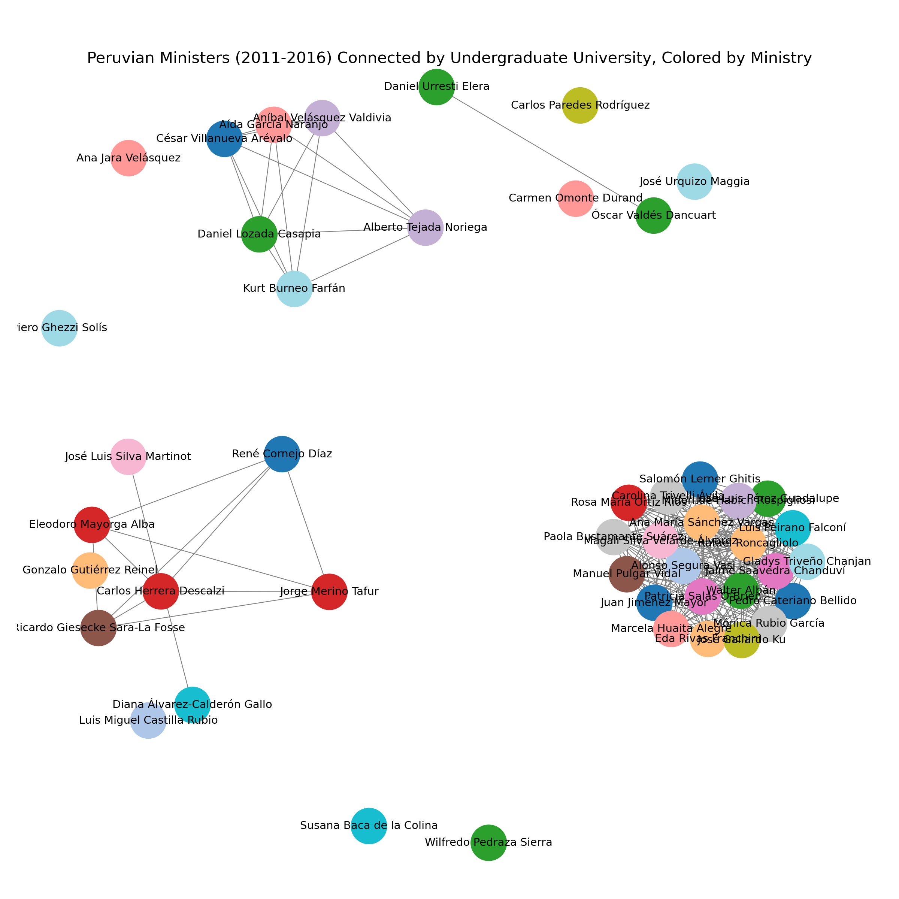
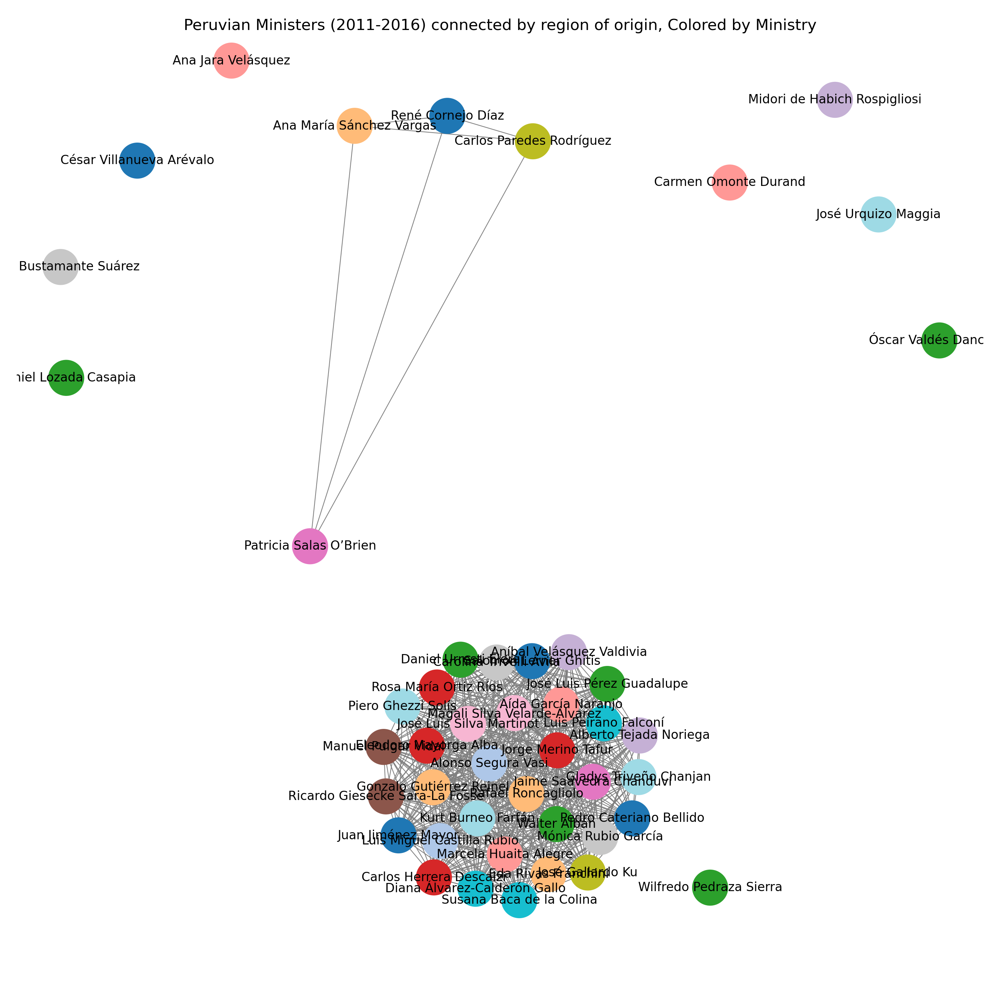
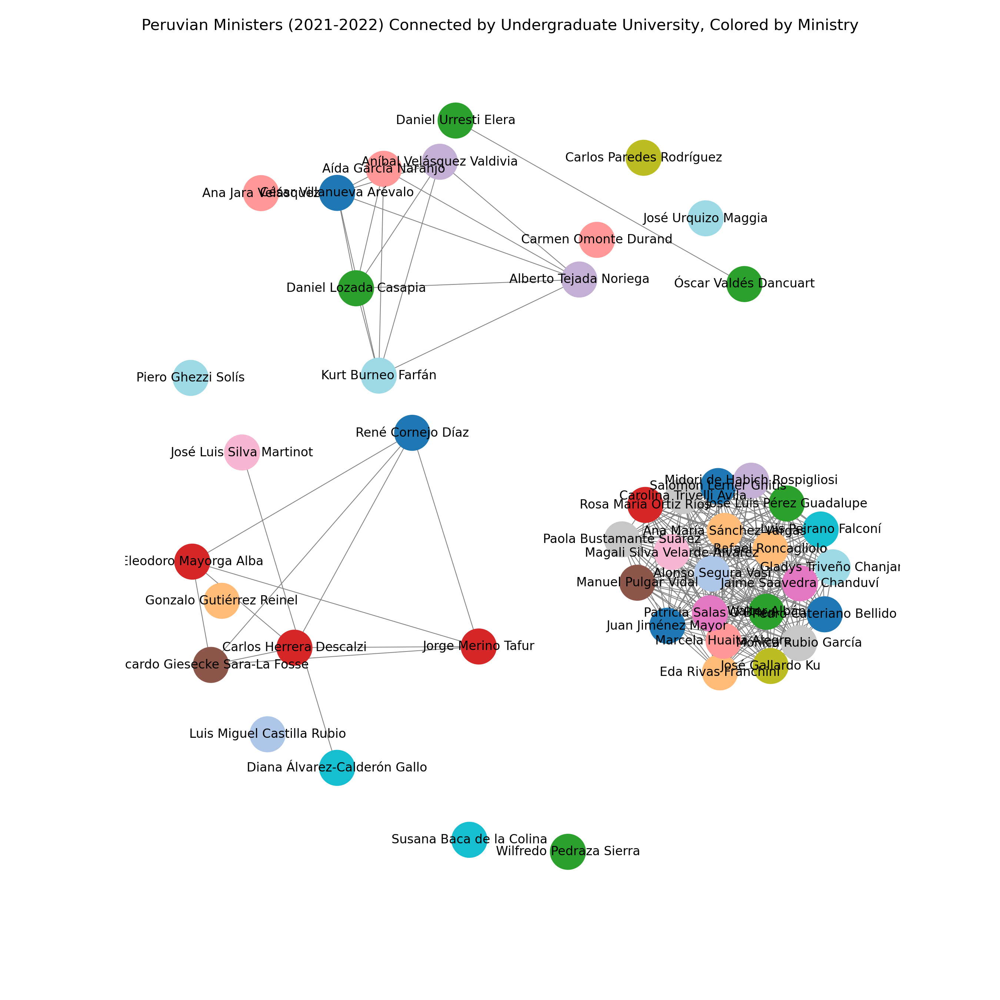

```{r setup, include=FALSE}
library(flexdashboard) # always
```

Sidebar {.sidebar}
=====================================


Preparing the dashboard based on the instructions given at @magallanes_reyes_data_2022, and @aden-buie_flexdashboard_2023

The minister network analysis was conducted as a team with Brisa Cruz


Chapter 1: 
===================================== 

### Argentina: work in progress



Chapter 2: 
===================================== 


### Perú: getting better




Chapter 3: 
===================================== 


### Ollanta's ministers: network by university




Chapter 4: 
===================================== 


### Ollanta's ministers: network by region of origin




Chapter 5
===================================== 


### Pedro Castillo's ministers: network by university




Chapter 6
===================================== 

### Pedro Castillo's ministers: network by Region


References
===================================== 


